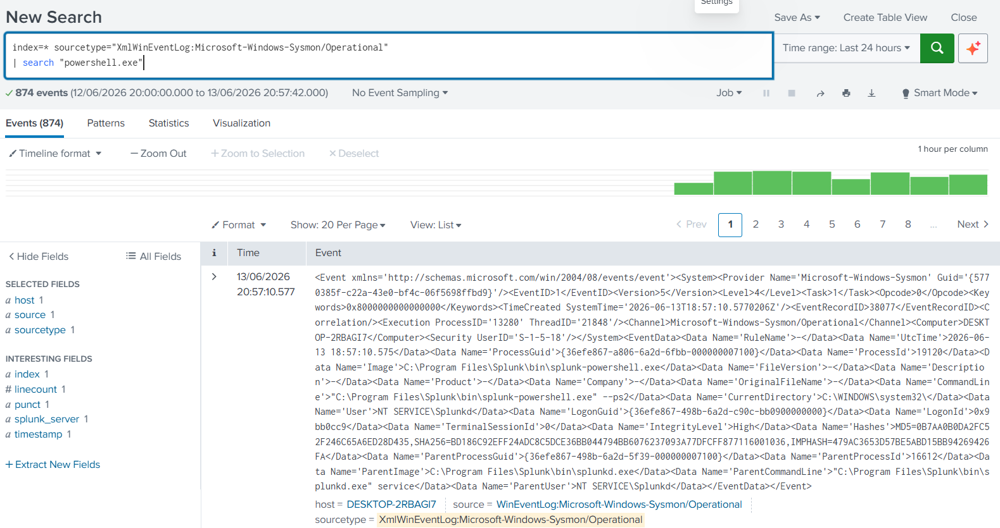
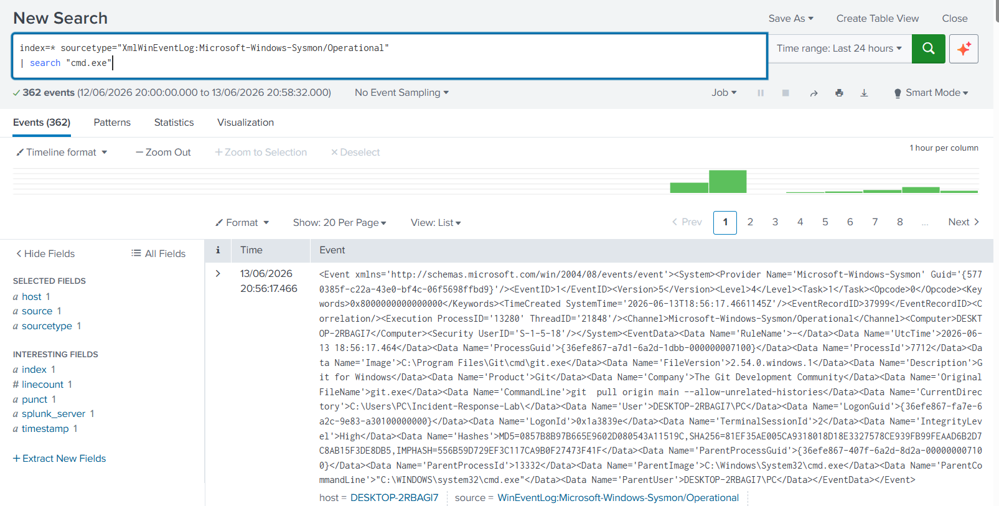
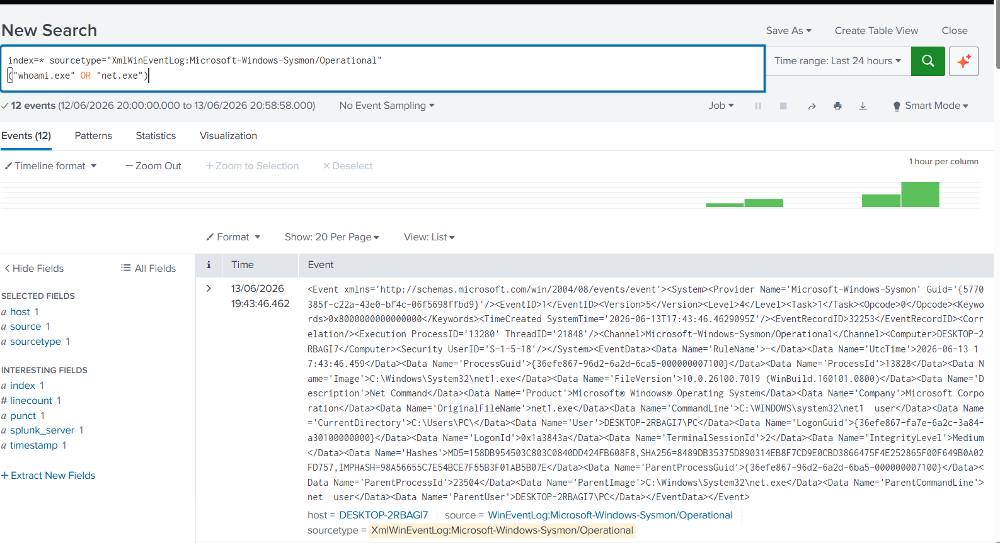
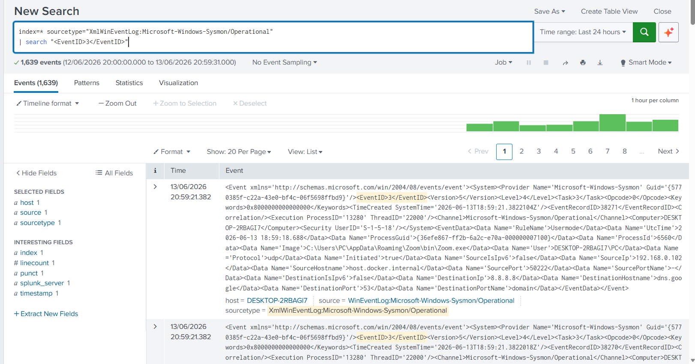
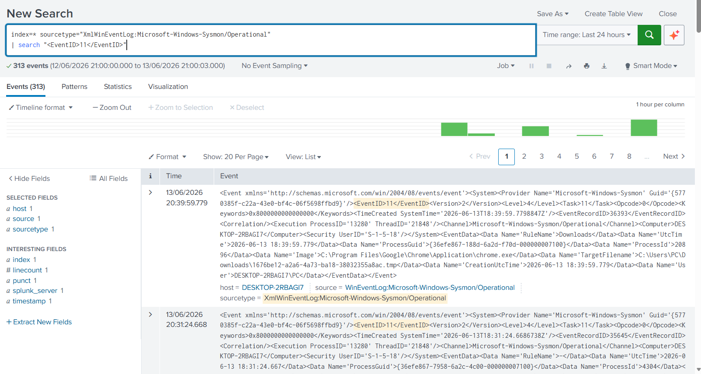

# Incident Response Lab

## Overview

This project demonstrates a basic incident response investigation using Splunk Enterprise, Sysmon telemetry, and Windows event logs.

The goal of this lab is to simulate a SOC analyst workflow: detect suspicious activity, investigate related events, build a timeline, document findings, and recommend response actions.

---

## Scenario

A suspicious PowerShell execution was detected on a Windows endpoint.

PowerShell is commonly used by administrators, but it is also frequently abused by attackers for execution, discovery, persistence, and payload delivery.

The objective of this investigation is to determine:

* What process executed PowerShell
* Which user account was involved
* Whether additional discovery activity occurred
* Whether there was related network or file activity
* What response actions should be recommended

---

## Environment

| Component  | Details                              |
| ---------- | ------------------------------------ |
| SIEM       | Splunk Enterprise 10.4               |
| Endpoint   | Windows 11                           |
| Telemetry  | Sysmon                               |
| Log Source | Microsoft-Windows-Sysmon/Operational |
| Framework  | MITRE ATT&CK                         |

---

## Detection

### Suspicious PowerShell Execution

```spl
index=* sourcetype="XmlWinEventLog:Microsoft-Windows-Sysmon/Operational"
| search "powershell.exe"
```

### MITRE ATT&CK Mapping

| Technique ID | Technique  |
| ------------ | ---------- |
| T1059.001    | PowerShell |

### Evidence



---

## Investigation Steps

### 1. Identify PowerShell Execution

The analyst reviewed Sysmon process execution events related to PowerShell.

```spl
index=* sourcetype="XmlWinEventLog:Microsoft-Windows-Sysmon/Operational"
| search "powershell.exe"
```

Evidence collected:


---

### 2. Review Command Shell Activity

The analyst searched for command prompt activity that may indicate follow-on execution or manual attacker activity.

```spl
index=* sourcetype="XmlWinEventLog:Microsoft-Windows-Sysmon/Operational"
| search "cmd.exe"
```

Evidence collected:



---

### 3. Check for Account Discovery

The analyst searched for account discovery commands commonly used during reconnaissance.

```spl
index=* sourcetype="XmlWinEventLog:Microsoft-Windows-Sysmon/Operational"
("whoami.exe" OR "net.exe" OR "net1.exe")
```

Evidence collected:



---

### 4. Review Network Connections

The analyst reviewed Sysmon network connection events to identify possible outbound communication.

```spl
index=* sourcetype="XmlWinEventLog:Microsoft-Windows-Sysmon/Operational"
| search "<EventID>3</EventID>"
```

Evidence collected:



---

### 5. Review File Creation Events

The analyst reviewed file creation activity to identify possible payload staging or dropped files.

```spl
index=* sourcetype="XmlWinEventLog:Microsoft-Windows-Sysmon/Operational"
| search "<EventID>11</EventID>"
```

Evidence collected:



---

## Incident Timeline

| Time | Activity                            | Evidence                |
| ---- | ----------------------------------- | ----------------------- |
| T1   | PowerShell execution detected       | Sysmon Process Creation |
| T2   | Command shell activity reviewed     | Sysmon Process Creation |
| T3   | Account discovery activity reviewed | whoami / net commands   |
| T4   | Network connections reviewed        | Sysmon Event ID 3       |
| T5   | File creation activity reviewed     | Sysmon Event ID 11      |

---

## Findings

* PowerShell execution was detected on the monitored endpoint.
* Command shell activity was reviewed for related activity.
* Account discovery commands were observed and investigated.
* Network connection events were reviewed for possible external communication.
* File creation activity was reviewed for signs of payload staging.
* No confirmed malicious payload was identified during this investigation.
* The activity was treated as suspicious and investigated according to SOC triage procedures.

---

## Response Recommendations

* Validate whether PowerShell activity was expected or authorized.
* Review the user account associated with the activity.
* Examine parent process and command-line arguments.
* Review related network communications.
* Investigate file creation events around the same timeframe.
* If malicious activity is confirmed:

  * Isolate the endpoint
  * Disable or reset the affected account
  * Collect forensic evidence
  * Escalate to the Incident Response team
  * Create or tune detections to improve visibility

---

## Lessons Learned

* Sysmon provides valuable endpoint telemetry for incident investigations.
* Splunk enables efficient analysis of process, network, and file events.
* PowerShell activity should always be reviewed in context with parent processes, user accounts, command-line arguments, network activity, and file operations.
* A structured investigation workflow improves consistency and response quality.

---

## Skills Demonstrated

* Incident Response
* SOC Alert Triage
* Splunk SPL
* Sysmon Analysis
* Windows Event Analysis
* MITRE ATT&CK Mapping
* Timeline Analysis
* Evidence Collection
* Detection Engineering
* Security Monitoring

---

## Author

**Agata Gabara**

Cybersecurity Analyst | SOC Analyst | Threat Hunter

GitHub: https://github.com/ag48665
